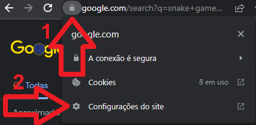
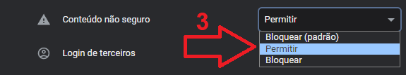

# GSM Mod (Google Snake Multiplayer Mod)

A mod that makes google snake game multiplayer!

Easy usage, only paste code on console (and disable secure content if you are connecting to a remote server, explained on browser usage).

This project uses [vf-ext](https://github.com/vanflux/vf-ext) to create browser extensions(only development). If you want to create extensions like this, take a look.

## Demo

## Usage

If you already has a server to connect go to [Browser Setup](#browser-setup), if not you will need to host your own([Server Setup](#server-setup));

### Server setup

- Install Node 16
- Clone repository: `git clone git@github.com:vanflux/google-snake-multiplayer-mod.git`
- Go to repository folder: `cd google-snake-multiplayer-mod`
- Install dependencies: `npm i`
- Run server: `npm run server`

### Browser setup

- Copy the code of the latest release [HERE](wait a sec).
- Search for `snake game` on google
- Open console with right click and select `inspect element`
- Paste the code on console and hit enter
- If you are **NOT** connecting to "localhost" or "127.0.0.1" you will need to do the following to disable secure content:

## Development

- Install Node 16
- Clone repository
- Install dependencies: `npm i`
- Run browser code as an auto reload extension: `npm start <chrome/firefox>`
- Load the extension located on `build/dev` on your browser
- Run server with `npm run server`
