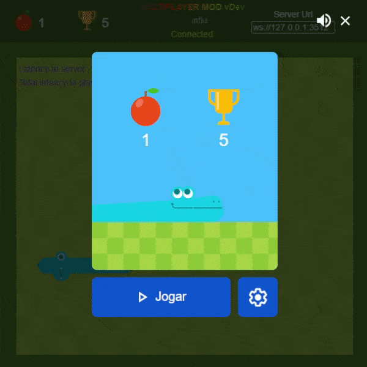

<h1 align="center">
  GSM Mod 
  <i>Google Snake Multiplayer Mod</i>
</h1>

  A mod that makes google snake game multiplayer!

  
  

  <b>AD time</b>: This project uses <a href="https://github.com/vanflux/vf-ext">vf-ext</a> to create browser extensions. 
  If you want to create extensions like this, take a look.

# Usage, Play the game

- Download the `gsm-bookmark.html` file from the [latest release](https://github.com/vanflux/google-snake-multiplayer-mod/releases/latest)
- Open `chrome://bookmarks/` on google chrome (sorry, firefox is not supported now)
- At the top on the right, click on the three-dots icon > `Import bookmarks` > select the downloaded `gsm-bookmark.html` file
- Open snake game
- At the top on the right, click on the three-dots icon > Bookmarks > GSM Mod
- Enjoy

# Demo

# Host my own server

- Install Node 16
- Clone repository: `git clone git@github.com:vanflux/google-snake-multiplayer-mod.git`
- Go to repository folder: `cd google-snake-multiplayer-mod`
- Install dependencies: `npm i`
- Run server: `npm run server`

# Development

- Install Node 16
- Clone repository
- Install dependencies: `npm i`
- Run browser code as an auto reload extension: `npm start <chrome/firefox>`
- Load the extension located on `build/dev` on your browser
- Run server with `npm run server`

# Network

The networking has been optimized since v0.1.2, we are not serializing the entire game instance, we are sending only the needed data, thanks to the linker by making the class field names more friendly.

- 2 Players playing an hour:
  - Each player uploads 200 B/packet * 5 packets/s = 1kB/s
  - Total download and upload(SEPARATELY) = (200 * 5 * 2 * 60 * 60) / 1000000 = 7.2 MB/hour

# Errors

I can't connect to my own server(IP address is not 127.0.0.1 or localhost):

You will need to do the following to disable secure content:

